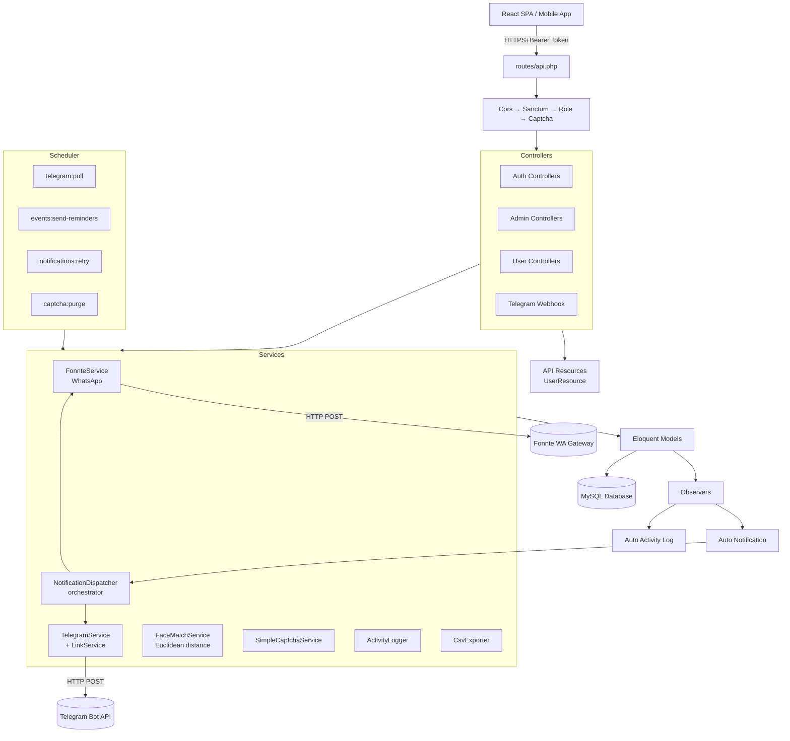
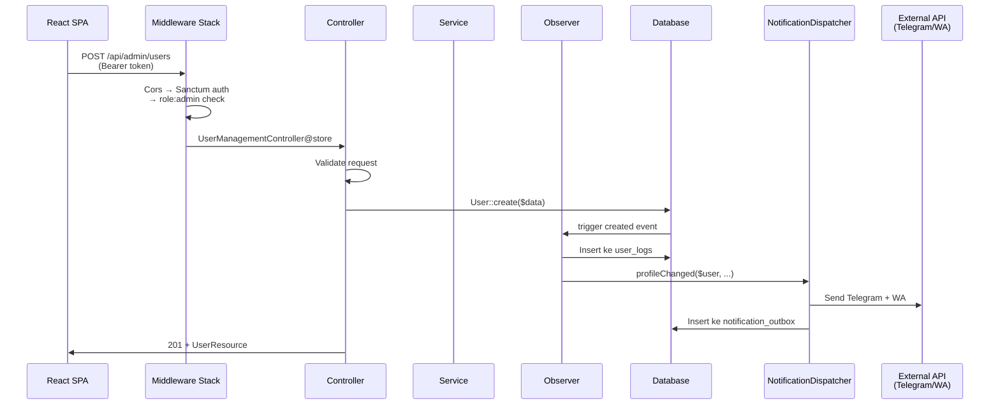
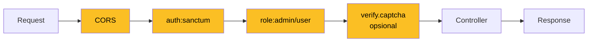

# Backend Architecture — Presensi TSX v2

## Tech Stack

| Komponen | Teknologi |
|---|---|
| Framework | Laravel 12 |
| PHP | 8.2+ (kompatibel sampai 8.5) |
| Database | MySQL 8.4 (InnoDB) |
| Auth | Sanctum (token-based) |
| Cache/Queue/Session | Database driver (no Redis needed) |
| HTTP Client | Guzzle 7 (via Laravel Http facade) |
| PDF | dompdf 3 (barryvdh/laravel-dompdf) |
| Activity Log | Custom (`ActivityLogger` service) |

---

## Layered Architecture



---

## Folder Structure (Backend)

```
app/
├── Console/Commands/         # Artisan commands
│   ├── DownloadFaceModels.php
│   ├── PollTelegramUpdates.php
│   ├── PurgeExpiredCaptchas.php
│   ├── RetryFailedNotifications.php
│   ├── SendEventReminders.php
│   └── SetTelegramWebhook.php
│
├── Http/
│   ├── Controllers/Api/
│   │   ├── Auth/             # Login, Captcha
│   │   ├── Admin/            # 9 controllers (CRUD admin)
│   │   ├── User/             # 9 controllers (user-side)
│   │   ├── TelegramWebhookController.php
│   │   └── Controller.php    # Base
│   ├── Middleware/
│   │   ├── Cors.php          # CORS handler
│   │   ├── RoleMiddleware.php # role:admin / role:user
│   │   └── VerifyCaptcha.php # Captcha guard
│   └── Resources/
│       └── UserResource.php  # API transformer
│
├── Models/                   # 16 Eloquent models
│   ├── User.php              # + helpers: getWhatsappDestination, generateTelegramLinkToken
│   ├── Attendance.php
│   ├── AttendanceLog.php
│   ├── CashCategory.php
│   ├── CashFlow.php
│   ├── CashFlowLog.php
│   ├── UserLog.php
│   ├── ProfileUpdateRequest.php
│   ├── FaceRegistration.php
│   ├── CalendarEvent.php
│   ├── EventCoordinator.php
│   ├── EventSpeaker.php
│   ├── EventParticipant.php
│   ├── NotificationOutbox.php
│   ├── CaptchaChallenge.php
│   └── Setting.php
│
├── Observers/                # Auto-trigger pas model berubah
│   ├── UserObserver.php      # Log + notif admin saat user CRUD
│   ├── AttendanceObserver.php
│   └── CashFlowObserver.php
│
├── Services/                 # Business logic
│   ├── ActivityLog/
│   │   ├── ActivityLogger.php   # Insert ke tabel log
│   │   └── CsvExporter.php       # Excel-friendly CSV
│   ├── Captcha/
│   │   └── SimpleCaptchaService.php  # SVG-based, no GD/imagick
│   ├── FaceRecognition/
│   │   └── FaceMatchService.php      # Euclidean distance
│   ├── Notification/
│   │   └── NotificationDispatcher.php # Multi-channel orchestrator
│   ├── Telegram/
│   │   ├── TelegramService.php       # Bot API wrapper
│   │   └── TelegramLinkService.php   # Self-connect handler
│   └── WhatsApp/
│       └── FonnteService.php         # Fonnte API wrapper
│
└── Providers/
    ├── AppServiceProvider.php
    └── EventServiceProvider.php  # Register observers
```

---

## Request Lifecycle



---

## Service Layer Detail

### 1. NotificationDispatcher (Orchestrator)

**Tanggung jawab**: Format pesan + dispatch ke semua channel aktif (WhatsApp + Telegram).

```php
$dispatcher->profileChanged($user, $field, $old, $new);
$dispatcher->attendanceCheckIn($user, $attendance);
$dispatcher->attendanceCheckOut($user, $attendance);
$dispatcher->eventReminder($event);
$dispatcher->cashFlowChanged($action, $cashFlow);
```

Di belakang layar:
- Pakai `TelegramService` (primary)
- Pakai `FonnteService` (kalau enabled)
- Both bisa aktif → dual-channel

---

### 2. TelegramService + TelegramLinkService

**Bot API wrapper** + **deep link self-connect**.

Flow self-connect:
1. User klik tombol "Hubungkan Telegram" → `POST /api/user/telegram/link`
2. Backend generate `tk_xxx` token, simpan di kolom `telegram_link_token`
3. Return `https://t.me/{bot}?start=tk_xxx`
4. User klik link → buka Telegram → klik START
5. Telegram kirim `/start tk_xxx` ke bot
6. **Polling** (`php artisan telegram:poll`) atau **webhook** tangkap update
7. `TelegramLinkService::processUpdate()` cari user dengan token itu
8. Update `telegram_chat_id` user, hapus token, set `telegram_linked_at`
9. Bot kirim balik konfirmasi

---

### 3. FaceMatchService

**Algoritma**: Euclidean distance antara dua descriptor 128-dim.

```php
public function distance(array $a, array $b): float {
    $sum = 0.0;
    for ($i = 0; $i < 128; $i++) {
        $d = $a[$i] - $b[$i];
        $sum += $d * $d;
    }
    return sqrt($sum);
}

public function matchUser(User $user, array $descriptor): array {
    $stored = FaceRegistration::where('user_id', $user->id)->first()->descriptor;
    $distance = $this->distance($descriptor, $stored);
    return [
        'matched'  => $distance < config('face.match_threshold'),
        'distance' => $distance,
        'score'    => 1 - $distance,
    ];
}
```

**Threshold default**: `0.40` (ketat, untuk membedakan saudara).

---

### 4. SimpleCaptchaService

SVG-based captcha, **tanpa dependency GD/imagick**.

Flow:
1. Client GET `/api/auth/captcha` → backend generate code 5 char
2. Render SVG dengan: gradient background + noise lines + dots + text rotated
3. Encode base64 → return ke client
4. Simpan di tabel `captcha_challenges` dengan TTL 5 menit
5. Saat login, validasi `captcha_id` + `captcha_answer`
6. Mark `used = true` setelah verifikasi (prevent replay)

---

### 5. ActivityLogger

Static helper untuk insert ke 3 tabel log:

```php
ActivityLogger::user($userId, 'updated', field: 'phone', before: '08...', after: '628...');
ActivityLogger::attendance($userId, 'check_in', $attendanceId, payload: [...]);
ActivityLogger::cashFlow($cashFlowId, 'created', after: [...], amount: 50000, type: 'income');
```

Otomatis isi `actor_id`, `ip_address`, `user_agent`, `device` dari current request.

---

### 6. CsvExporter

Helper export Excel-friendly:
- BOM UTF-8 (emoji & karakter ID utuh)
- Delimiter `;` (Excel locale ID)
- Streaming (gak load semua row ke memory)

```php
return CsvExporter::stream($collection, $headers, 'attendance-2026-05.csv');
```

---

## Observer Pattern

Setiap kali model `User`/`Attendance`/`CashFlow` di-create/update/delete, observer auto-jalan:

```php
// app/Providers/EventServiceProvider.php
User::observe(UserObserver::class);
Attendance::observe(AttendanceObserver::class);
CashFlow::observe(CashFlowObserver::class);
```

**UserObserver**:
- `created` → log + notif admin "user baru"
- `updated` → log per-field berubah + notif admin per field penting (name, email, phone, position, role, is_active, avatar)
- `deleted` → log + notif

**AttendanceObserver**:
- `created` → log dengan face_score, location, device
- `updated/deleted` → log changes

**CashFlowObserver**:
- `created` → log + notif admin
- `updated/deleted` → log

---

## Console Commands (Artisan)

| Command | Fungsi | Schedule |
|---|---|---|
| `telegram:poll` | Long-polling Telegram getUpdates (dev) | manual / always |
| `telegram:set-webhook` | Set webhook (production) | manual sekali |
| `events:send-reminders` | Kirim reminder peserta event | every 5 min |
| `notifications:retry` | Retry notif yg gagal di outbox | every 15 min |
| `captcha:purge` | Cleanup captcha kadaluarsa | hourly |
| `face:download-models` | Download model face-api.js | manual |

Schedule terdaftar di `routes/console.php`:
```php
Schedule::command('events:send-reminders')->everyFiveMinutes();
Schedule::command('captcha:purge')->hourly();
Schedule::command('notifications:retry')->everyFifteenMinutes();
```

---

## Middleware Stack



---

## Configuration Files

| File | Apa |
|---|---|
| `config/app.php` | App basic, timezone Asia/Jakarta |
| `config/auth.php` | Sanctum guards |
| `config/database.php` | MySQL/PgSQL/SQLite drivers |
| `config/sanctum.php` | Token & stateful domains |
| `config/captcha.php` | TTL, length, characters |
| `config/face.php` | match_threshold, min_confidence |
| `config/fonnte.php` | WA token, base_url, admin_numbers |
| `config/telegram.php` | Bot token, admin_chat_ids, webhook_secret |
| `config/filesystems.php` | Storage disks (public, local) |

---

## Error Handling

`bootstrap/app.php` register custom handler:

```php
$exceptions->render(function (AuthenticationException $e, Request $request) {
    if ($request->is('api/*') || $request->expectsJson()) {
        return response()->json([
            'message' => 'Unauthenticated. Token tidak valid atau belum login.',
            'authenticated' => false,
        ], 401);
    }
});
```

Ini fix issue klasik: API request unauthenticated jadi redirect ke `route('login')` yg gak ada.

---

## Security Considerations

- **CSRF**: Sanctum stateful API → otomatis handle
- **CORS**: Allow all origins di dev (`Access-Control-Allow-Origin: *`)
- **Captcha**: Wajib di login (anti-bruteforce)
- **Password**: Hashed dengan bcrypt cost 12 (Laravel default)
- **Token**: Sanctum personal access token, no expiration default
- **SQL Injection**: Eloquent ORM, no raw queries
- **XSS**: React auto-escape di frontend; backend return JSON
- **File upload**: Validated extension + max size 4MB
- **Webhook**: Secret di URL untuk verify request dari Telegram

---

## Performance Tuning

### Database Indexing
Lihat [DATABASE.md](./DATABASE.md) — semua tabel sudah di-index untuk query patterns yang umum.

### Cache Settings
Settings table cached pakai `Cache::remember`:
```php
Setting::get('work_start_time'); // cached 1 jam
```

### Eager Loading
Semua list endpoint pakai `with()` untuk avoid N+1:
```php
CashFlow::with(['creator:id,name', 'category:id,name,icon,color'])->paginate();
```

### Streaming Export
CSV export pakai `Response::stream()` — gak buffer semua data ke memory.

---

## Adding New Feature Checklist

1. **Migration** — `php artisan make:migration create_xxx_table`
2. **Model** — buat di `app/Models/`, definisi $fillable, casts, relationships
3. **Controller** — di `app/Http/Controllers/Api/{Admin|User}/`
4. **Routes** — daftar di `routes/api.php` dengan middleware yang tepat
5. **Resource (opsional)** — `php artisan make:resource XxxResource`
6. **Observer (opsional)** — kalau perlu auto-log/notif → register di EventServiceProvider
7. **Service (opsional)** — kalau ada business logic kompleks
8. **Test** — `php artisan make:test XxxTest`
9. **Frontend integration** — buat page/component di `resources/js/`

---

## Deployment Notes

### Production Checklist
- [ ] Set `APP_ENV=production`, `APP_DEBUG=false`
- [ ] Generate fresh `APP_KEY`: `php artisan key:generate`
- [ ] Set HTTPS (`APP_URL=https://...`)
- [ ] Setup Telegram webhook (gak pakai polling): `php artisan telegram:set-webhook`
- [ ] Setup cron untuk schedule:run: `* * * * * cd /path && php artisan schedule:run`
- [ ] Setup queue worker (supervisord): `php artisan queue:work --tries=3`
- [ ] Cache config: `php artisan config:cache && php artisan route:cache && php artisan view:cache`
- [ ] Optimize autoload: `composer install --optimize-autoloader --no-dev`
- [ ] Build frontend: `npm run build`
- [ ] Set permissions: `chmod -R 775 storage bootstrap/cache`
- [ ] Setup SSL untuk webhook Telegram (mandatory)

### Recommended Hosting
- VPS (Niagahoster, IDCloudHost) — full control
- Railway / Vercel (frontend) + serverless function
- Forge + DigitalOcean — Laravel-friendly
