# Dokumentasi Database — Presensi TSX v2

## Ringkasan

- **DBMS**: MySQL 8.4+ (kompatibel MariaDB 10.5+)
- **Charset/Collation**: `utf8mb4` / `utf8mb4_unicode_ci`
- **Engine**: InnoDB
- **Total Tabel**: 19 (16 inti + 3 default Laravel)

---

## ERD (Entity Relationship Diagram)

```mermaid
erDiagram
    USERS ||--o{ ATTENDANCE : "punya"
    USERS ||--o| FACE_REGISTRATIONS : "punya 1"
    USERS ||--o{ PROFILE_UPDATE_REQUESTS : "ajukan"
    USERS ||--o{ CASH_FLOW : "buat"
    USERS ||--o{ USER_LOGS : "tercatat"
    USERS ||--o{ ATTENDANCE_LOGS : "tercatat"
    USERS ||--o{ CASH_FLOW_LOGS : "tercatat"
    USERS ||--o{ EVENT_PARTICIPANTS : "ikut"
    USERS ||--o{ EVENT_SPEAKERS : "menjadi"
    USERS ||--o{ EVENT_COORDINATORS : "menjadi"
    USERS ||--o{ CALENDAR_EVENTS : "membuat"
    USERS ||--o{ NOTIFICATION_OUTBOX : "tujuan"

    ATTENDANCE ||--o{ ATTENDANCE_LOGS : "menghasilkan"

    CASH_CATEGORIES ||--o{ CASH_FLOW : "kategori"
    CASH_FLOW ||--o{ CASH_FLOW_LOGS : "menghasilkan"

    CALENDAR_EVENTS ||--o{ EVENT_PARTICIPANTS : "memiliki"
    CALENDAR_EVENTS ||--o{ EVENT_SPEAKERS : "memiliki"
    CALENDAR_EVENTS ||--o{ EVENT_COORDINATORS : "memiliki"

    USERS {
        bigint id PK
        string name
        string nik UK
        string position
        string email UK
        string phone
        text address
        text bio
        string avatar
        enum role "admin|user"
        boolean is_active
        boolean is_confirmed
        string whatsapp_number
        boolean whatsapp_notification
        string telegram_chat_id
        string telegram_username
        boolean telegram_notification
        string telegram_link_token UK
        timestamp telegram_linked_at
        timestamp email_verified_at
        string password
        timestamp created_at
        timestamp updated_at
        timestamp deleted_at
    }

    ATTENDANCE {
        bigint id PK
        bigint user_id FK
        enum type "in|out"
        date date
        time time
        string photo_path
        boolean face_verified
        float face_score
        string location
        double latitude
        double longitude
        enum status "on_time|late|early_leave|overtime"
        text notes
        timestamp created_at
    }

    FACE_REGISTRATIONS {
        bigint id PK
        bigint user_id FK,UK
        json descriptor "128-dim vector"
        string photo_path
        float quality_score
        boolean is_active
        timestamp registered_at
        timestamp created_at
        timestamp updated_at
    }

    CASH_CATEGORIES {
        bigint id PK
        string name
        enum type "income|expense"
        string icon
        string color
        boolean is_active
    }

    CASH_FLOW {
        bigint id PK
        bigint category_id FK
        text description
        decimal amount
        enum type "income|expense"
        date date
        string reference_no
        string attachment_path
        bigint created_by FK
        bigint approved_by FK
        enum status "pending|approved|rejected"
        timestamp created_at
        timestamp updated_at
        timestamp deleted_at
    }

    PROFILE_UPDATE_REQUESTS {
        bigint id PK
        bigint user_id FK
        string field
        text old_value
        text new_value
        enum status "pending|approved|rejected"
        text admin_notes
        bigint approved_by FK
        timestamp requested_at
        timestamp approved_at
    }

    CALENDAR_EVENTS {
        bigint id PK
        string title
        text description
        string location
        timestamp event_at
        timestamp event_end_at
        int notify_before "menit"
        enum category
        enum visibility "public|participants_only|private"
        string color
        bigint created_by FK
        boolean reminder_sent
        boolean is_active
        timestamp created_at
        timestamp deleted_at
    }

    EVENT_COORDINATORS {
        bigint id PK
        bigint event_id FK
        bigint user_id FK
        string name
        string role
        string phone
        string email
    }

    EVENT_SPEAKERS {
        bigint id PK
        bigint event_id FK
        bigint user_id FK
        string name
        string title
        string organization
        string topic
        text bio
        string photo_path
        time start_time
        time end_time
        int order
    }

    EVENT_PARTICIPANTS {
        bigint id PK
        bigint event_id FK
        bigint user_id FK
        string name
        string email
        string phone
        string institution
        enum status "invited|confirmed|attended|absent|cancelled"
        timestamp registered_at
        timestamp confirmed_at
        timestamp attended_at
        boolean reminder_sent
        text notes
    }

    USER_LOGS {
        bigint id PK
        bigint user_id FK
        bigint actor_id FK
        enum action
        string field
        json before
        json after
        string ip_address
        string user_agent
        boolean notification_sent
        timestamp logged_at
    }

    ATTENDANCE_LOGS {
        bigint id PK
        bigint attendance_id FK
        bigint user_id FK
        bigint actor_id FK
        enum action
        json payload
        json changes
        string ip_address
        string device
        boolean face_verified
        float face_score
        timestamp logged_at
    }

    CASH_FLOW_LOGS {
        bigint id PK
        bigint cash_flow_id FK
        bigint actor_id FK
        enum action
        json before
        json after
        decimal amount
        enum type
        string ip_address
        timestamp logged_at
    }

    NOTIFICATION_OUTBOX {
        bigint id PK
        enum channel "whatsapp|telegram|email|in_app"
        string recipient
        bigint user_id FK
        string event_type
        string subject
        text message
        json payload
        enum status "pending|sent|failed|retry"
        text response
        int attempts
        timestamp sent_at
        timestamp created_at
    }

    SETTINGS {
        bigint id PK
        string key UK
        text value
        string group
        string type
        string label
        text description
    }

    CAPTCHA_CHALLENGES {
        uuid id PK
        string code
        string ip_address
        boolean used
        timestamp expires_at
        timestamp created_at
    }
```



---

## Tabel-Tabel

### 1. `users` — Tabel Inti User

| Kolom | Tipe | Keterangan |
|---|---|---|
| `id` | BIGINT PK | Auto-increment |
| `name` | VARCHAR(255) | Nama lengkap |
| `nik` | VARCHAR(30) UNIQUE | Nomor induk karyawan |
| `position` | VARCHAR(255) | Posisi/jabatan |
| `email` | VARCHAR(255) UNIQUE | Email login |
| `phone` | VARCHAR(25) | Nomor telepon |
| `address` | TEXT | Alamat lengkap |
| `bio` | TEXT | Bio singkat |
| `avatar` | VARCHAR(255) | Path foto profil |
| `role` | ENUM('admin','user') | Default: 'user' |
| `is_active` | BOOLEAN | Default: true |
| `is_confirmed` | BOOLEAN | Default: false |
| `whatsapp_number` | VARCHAR(25) | Format 628xxx |
| `whatsapp_notification` | BOOLEAN | Toggle notif WA |
| `telegram_chat_id` | VARCHAR(50) | Chat ID Telegram |
| `telegram_username` | VARCHAR(100) | @username |
| `telegram_notification` | BOOLEAN | Toggle notif TG |
| `telegram_link_token` | VARCHAR(50) UNIQUE | Token sekali pakai |
| `telegram_linked_at` | TIMESTAMP | Kapan link Telegram |
| `password` | VARCHAR(255) | Hashed (bcrypt) |
| `timestamps` | + softDeletes | created_at, updated_at, deleted_at |

**Index**:
- `role`, `is_active`, `(role, is_active)`, `phone`, `whatsapp_number`, `telegram_chat_id`

---

### 2. `attendance` — Catatan Presensi

| Kolom | Tipe | Keterangan |
|---|---|---|
| `id` | BIGINT PK | |
| `user_id` | BIGINT FK→users | CASCADE delete |
| `type` | ENUM('in','out') | Check-in atau out |
| `date` | DATE | Tanggal presensi |
| `time` | TIME | Jam presensi |
| `photo_path` | VARCHAR(255) | Foto saat presensi |
| `face_verified` | BOOLEAN | Hasil verifikasi wajah |
| `face_score` | FLOAT | Confidence 0-1 |
| `location` | VARCHAR(255) | Label lokasi |
| `latitude`, `longitude` | DOUBLE | Koordinat GPS |
| `status` | ENUM | on_time/late/early_leave/overtime |
| `notes` | TEXT | Catatan tambahan |
| `created_at` | TIMESTAMP | Auto |

**Index**: `(user_id, date)`, `(user_id, date, type)`, `(date, type)`, `status`, `created_at`

---

### 3. `face_registrations` — Pendaftaran Wajah

| Kolom | Tipe | Keterangan |
|---|---|---|
| `id` | BIGINT PK | |
| `user_id` | BIGINT FK UNIQUE | 1 user 1 face |
| `descriptor` | JSON | Array float 128-dim |
| `photo_path` | VARCHAR(255) | Foto referensi |
| `quality_score` | FLOAT | Kualitas saat capture |
| `is_active` | BOOLEAN | Default: true |
| `registered_at` | TIMESTAMP | |

---

### 4. `cash_categories` — Kategori Transaksi

| Kolom | Tipe | Keterangan |
|---|---|---|
| `id` | BIGINT PK | |
| `name` | VARCHAR(100) | Nama kategori |
| `type` | ENUM('income','expense') | |
| `icon` | VARCHAR(50) | Nama icon Lucide |
| `color` | VARCHAR(9) | Hex color |
| `is_active` | BOOLEAN | |

**Default Seed**: 11 kategori (5 income, 6 expense)

---

### 5. `cash_flow` — Transaksi Kas

| Kolom | Tipe | Keterangan |
|---|---|---|
| `id` | BIGINT PK | |
| `category_id` | BIGINT FK | nullOnDelete |
| `description` | TEXT | |
| `amount` | DECIMAL(15,2) | |
| `type` | ENUM | income/expense |
| `date` | DATE | |
| `reference_no` | VARCHAR(255) | No. nota/invoice |
| `attachment_path` | VARCHAR(255) | Bukti |
| `created_by` | BIGINT FK→users | |
| `approved_by` | BIGINT FK→users | nullable |
| `status` | ENUM | pending/approved/rejected |

**Index**: `(date, type)`, `(type, status)`, `(created_by, date)`, `(category_id, date)`, `status`

---

### 6. `calendar_events` — Acara

| Kolom | Tipe | Keterangan |
|---|---|---|
| `id` | BIGINT PK | |
| `title` | VARCHAR(255) | |
| `description` | TEXT | |
| `location` | VARCHAR(255) | |
| `event_at` | TIMESTAMP | Mulai |
| `event_end_at` | TIMESTAMP | Selesai |
| `notify_before` | INT | Reminder X menit sebelum |
| `category` | ENUM | meeting/training/workshop/seminar/event/other |
| `visibility` | ENUM | public/participants_only/private |
| `color` | VARCHAR(9) | Hex color |
| `created_by` | BIGINT FK | |
| `reminder_sent` | BOOLEAN | Sudah kirim reminder? |
| `is_active` | BOOLEAN | |

---

### 7-9. `event_coordinators`, `event_speakers`, `event_participants`

**Pattern Sama** (one-to-many ke `calendar_events`):

| Kolom | event_coordinators | event_speakers | event_participants |
|---|---|---|---|
| `event_id` FK | ✓ | ✓ | ✓ |
| `user_id` FK | nullable | nullable | nullable |
| `name` | ✓ | ✓ | ✓ |
| `role` | "Penanggung Jawab" | - | - |
| `title/topic` | - | gelar, topik | - |
| `bio` | - | ✓ | - |
| `phone/email` | ✓ | - | ✓ |
| `status` | - | - | invited/confirmed/attended/absent |
| `attended_at` | - | - | ✓ |

---

### 10-12. `attendance_logs`, `cash_flow_logs`, `user_logs` — Audit Trail

Semua tabel log punya struktur mirip:

| Kolom | Keterangan |
|---|---|
| `id` PK | |
| `[entity]_id` FK | Reference ke entity yg di-log |
| `actor_id` FK→users | Siapa yang melakukan aksi |
| `action` ENUM | created/updated/deleted/login/etc |
| `before` JSON | Snapshot sebelum |
| `after` JSON | Snapshot sesudah |
| `ip_address`, `user_agent` | Tracking |
| `logged_at` | Timestamp aksi |

---

### 13. `notification_outbox` — Tracking Notifikasi

| Kolom | Tipe | Keterangan |
|---|---|---|
| `channel` | ENUM | whatsapp/telegram/email/in_app |
| `recipient` | VARCHAR | Nomor WA / chat_id TG |
| `user_id` FK | nullable | |
| `event_type` | VARCHAR | profile.updated, attendance.checkin, dll |
| `message` | TEXT | Konten pesan |
| `payload` | JSON | Data tambahan |
| `status` | ENUM | pending/sent/failed/retry |
| `response` | TEXT | Response API gateway |
| `attempts` | INT | Retry counter |
| `sent_at` | TIMESTAMP | Berhasil kirim |

---

### 14. `settings` — Konfigurasi Sistem

Key-value store cached. Default seed:
- `work_start_time` = "08:00:00"
- `work_end_time` = "17:00:00"
- `office_latitude`, `office_longitude`, `office_radius`
- `company_name`

---

### 15. `captcha_challenges` — Anti-Bot

UUID-based, expires 5 menit, used flag untuk prevent replay attack.

---

### 16-19. Default Laravel

`cache`, `cache_locks`, `jobs`, `job_batches`, `failed_jobs`, `personal_access_tokens`, `password_reset_tokens`, `sessions`, `migrations`

---

## Indexing Strategy

Setiap tabel punya **composite indexes** sesuai pola query yg sering dipakai:

```sql
-- Attendance: paling sering di-query by user + tanggal
INDEX (user_id, date), (user_id, date, type), (date, type)

-- Cash flow: filter by tipe + status + bulan
INDEX (date, type), (type, status), (created_by, date)

-- Calendar event: cari upcoming + by category
INDEX (event_at), (event_at, is_active), (category)

-- User: filter by role + active
INDEX (role), (is_active), (role, is_active)

-- Logs: pencarian by waktu + actor
INDEX (logged_at), (action, logged_at), (user_id, logged_at)

-- Notification outbox: retry queue
INDEX (status, created_at), (channel, status)
```

---

## Soft Deletes

Tabel yang pakai soft delete (`deleted_at`):
- `users`
- `cash_flow`
- `calendar_events`

Restore dengan: `User::withTrashed()->find($id)->restore()`

---

## Migration File List

```
0001_01_01_000000_create_users_table.php
0001_01_01_000001_create_cache_table.php
0001_01_01_000002_create_jobs_table.php
2026_05_01_000000_create_personal_access_tokens_table.php
2026_05_01_000001_create_settings_table.php
2026_05_01_000002_create_attendance_table.php
2026_05_01_000003_create_face_registrations_table.php
2026_05_01_000004_create_cash_categories_table.php
2026_05_01_000005_create_cash_flow_table.php
2026_05_01_000006_create_profile_update_requests_table.php
2026_05_01_000007_create_calendar_events_table.php
2026_05_01_000008_create_event_coordinators_table.php
2026_05_01_000009_create_event_speakers_table.php
2026_05_01_000010_create_event_participants_table.php
2026_05_01_000011_create_attendance_logs_table.php
2026_05_01_000012_create_cash_flow_logs_table.php
2026_05_01_000013_create_user_logs_table.php
2026_05_01_000014_create_notification_outbox_table.php
2026_05_01_000015_create_captcha_challenges_table.php
2026_05_03_000001_add_telegram_to_users_table.php
2026_05_03_000002_add_telegram_link_token_to_users.php
```
