# Application Flow Diagrams — Presensi TSX v2

Semua diagram pakai **Mermaid** (langsung kerender di GitHub/VSCode preview).

---

## 1. Login Flow (with Captcha)

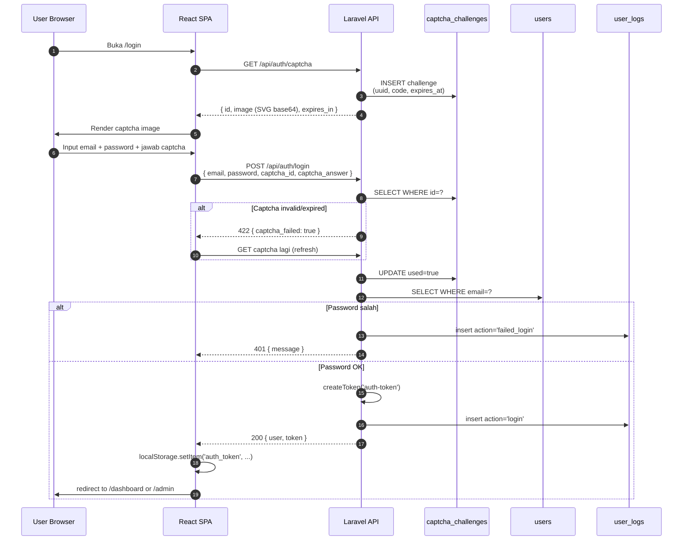

---

## 2. Check-In Flow (with Face Recognition)

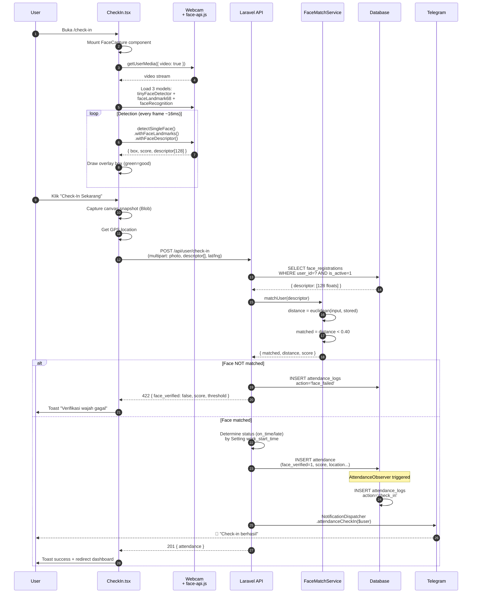

---

## 3. Face Registration Flow

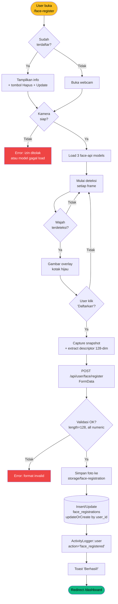

---

## 4. Telegram Self-Connect Flow (Opsi B)

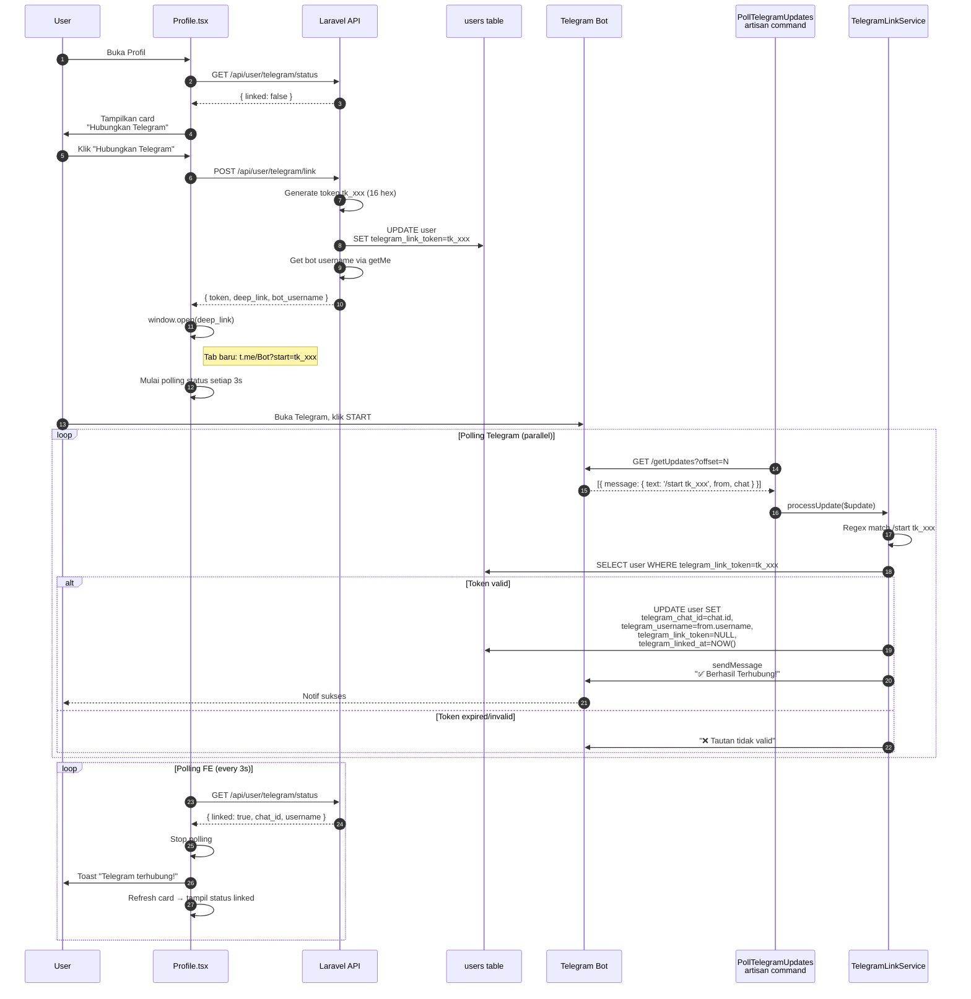

---

## 5. Event Reminder (Scheduled)

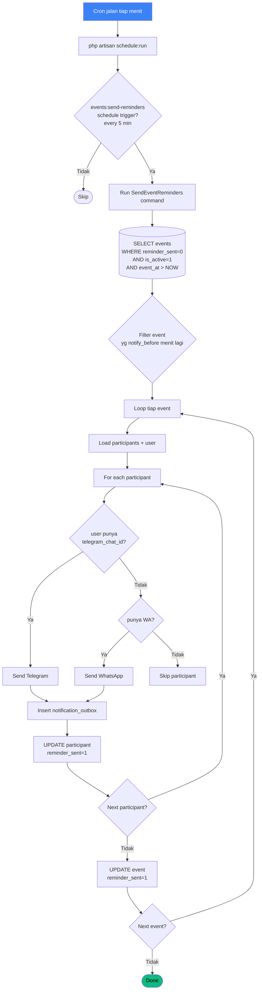

---

## 6. Profile Update Approval Flow

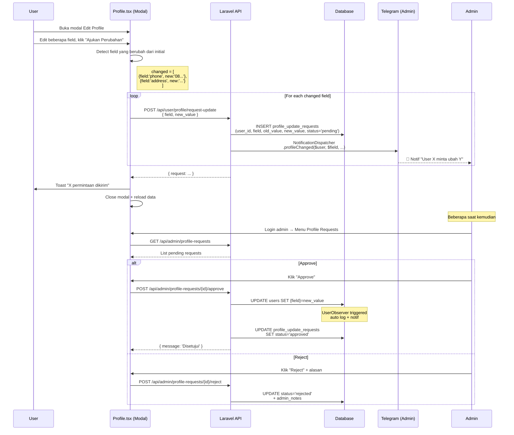

---

## 7. Cash Flow Approval Flow

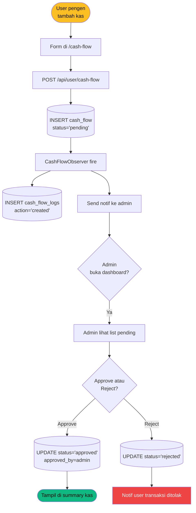

---

## 8. Architecture: Notif Multi-Channel

```mermaid
flowchart LR
    Trigger[Event trigger:<br/>user updated /<br/>check-in /<br/>cash flow] --> Disp[NotificationDispatcher]

    Disp --> Format[Format pesan:<br/>greeting + detail + emoji]
    Format --> Branch1{Telegram<br/>enabled?}
    Format --> Branch2{WhatsApp<br/>enabled?}

    Branch1 -->|Ya| TGS[TelegramService.send]
    Branch2 -->|Ya| WAS[FonnteService.send]

    TGS --> TGAPI[POST api.telegram.org<br/>/bot{TOKEN}/sendMessage]
    WAS --> WAAPI[POST api.fonnte.com/send<br/>Authorization: token]

    TGAPI --> Outbox1[(Insert notification_outbox<br/>channel='telegram')]
    WAAPI --> Outbox2[(Insert notification_outbox<br/>channel='whatsapp')]

    TGAPI -->|Success| TGOK[User dapet notif Telegram]
    WAAPI -->|Success| WAOK[User dapet notif WA]
    TGAPI -->|Fail| TGFail[status='failed'<br/>retry by scheduler]
    WAAPI -->|Fail| WAFail[status='failed']

    style TGS fill:#0088cc,color:#fff
    style WAS fill:#25d366,color:#fff
    style TGOK fill:#10b981,color:#000
    style WAOK fill:#10b981,color:#000
```

---

## 9. Activity Log Auto-Trigger

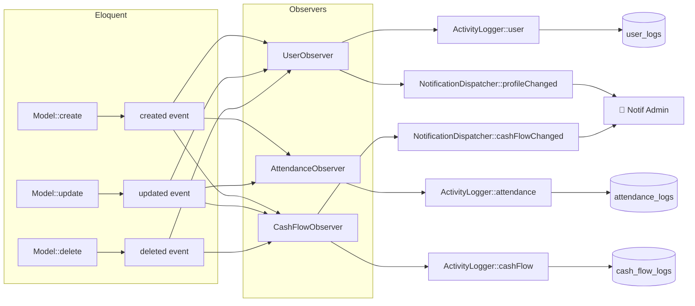

---

## 10. Captcha Generation Flow

```mermaid
sequenceDiagram
    participant Client
    participant API
    participant CSS as SimpleCaptchaService
    participant DB as captcha_challenges

    Client->>API: GET /api/auth/captcha
    API->>CSS: generate(ip)
    CSS->>CSS: randomCode(len=5)<br/>chars=ABCDEFGHJKLMNPQRSTUVWXYZ23456789
    CSS->>DB: INSERT (id=uuid, code, ip,<br/>expires_at=now+5min, used=false)
    CSS->>CSS: renderSvg(code):<br/>1. Gradient bg<br/>2. 6 noise lines<br/>3. 30 dots<br/>4. Text rotated random
    CSS->>CSS: base64 encode SVG
    CSS-->>API: { id, image, expires_in }
    API-->>Client: 200 { id, image: 'data:image/svg+xml;base64,...' }

    Note over Client: User input answer
    Client->>API: POST /api/auth/login<br/>{ ..., captcha_id, captcha_answer }
    API->>CSS: verify(id, answer, ip)
    CSS->>DB: SELECT WHERE id=?
    alt Not found OR used OR expired
        CSS-->>API: false
        API-->>Client: 422 captcha_failed
    else Valid
        CSS->>DB: UPDATE used=true (prevent replay)
        CSS->>CSS: hash_equals($stored, $given)
        CSS-->>API: true/false
    end
```

---

## 11. PDF Export Flow

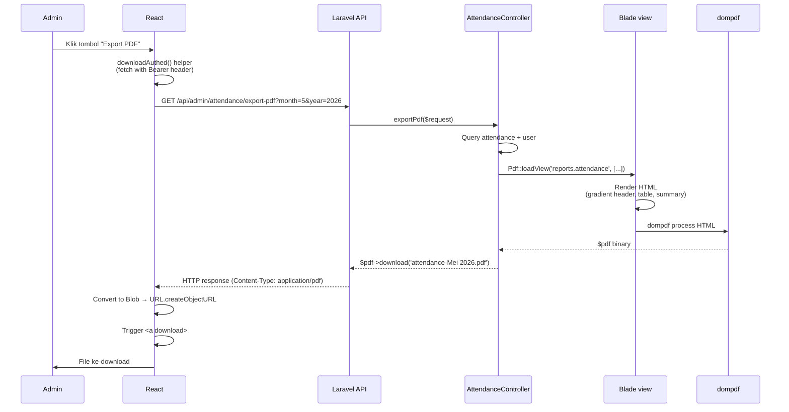

---

## 12. High-Level System Architecture

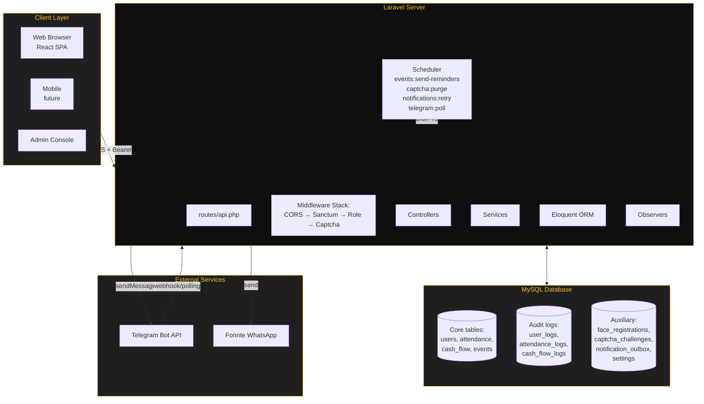

---

## 13. Frontend Routing Flow

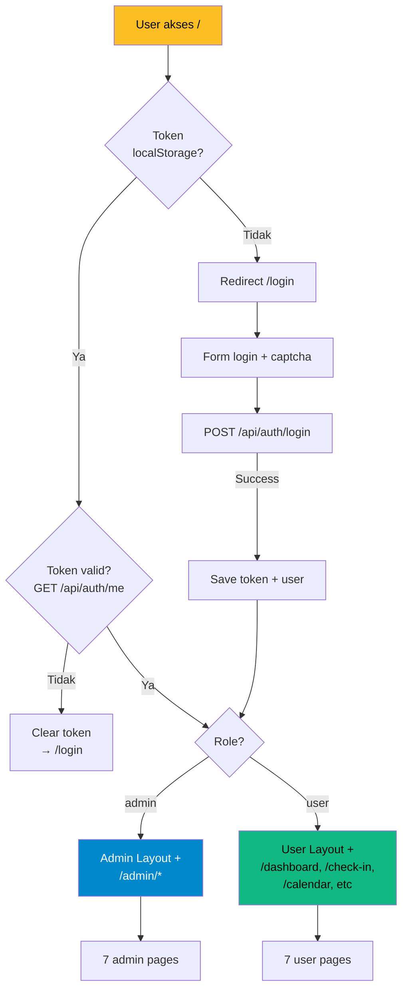

---

## Quick Reference: Tools to Render Diagrams

- **GitHub README** — auto-render Mermaid (sejak 2022)
- **VSCode** — install "Markdown Preview Mermaid Support"
- **Online**: https://mermaid.live/ — paste blok mermaid → instant preview/export PNG/SVG
- **Docusaurus / GitBook** — built-in support
- **Notion** — paste blok ke code block dengan language: mermaid

---

## Diagram Update Process

Setiap kali ada **fitur baru**:
1. Update [DATABASE.md](./DATABASE.md) — kalau ada tabel/relasi baru
2. Update [API.md](./API.md) — kalau ada endpoint baru
3. Update [BACKEND.md](./BACKEND.md) — kalau ada service/observer baru
4. Update [FLOW.md](./FLOW.md) — tambah sequence diagram fitur baru
